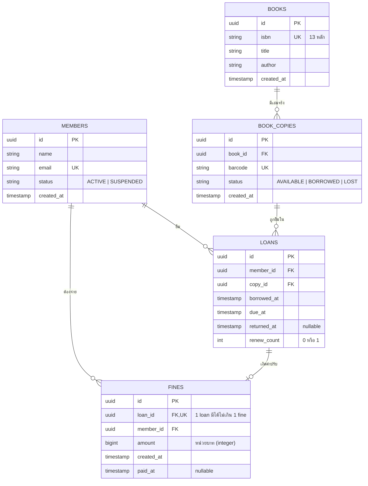
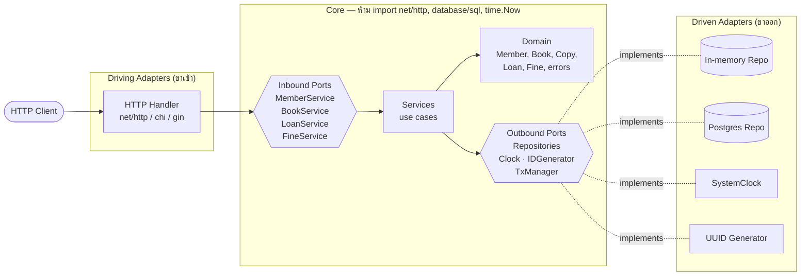
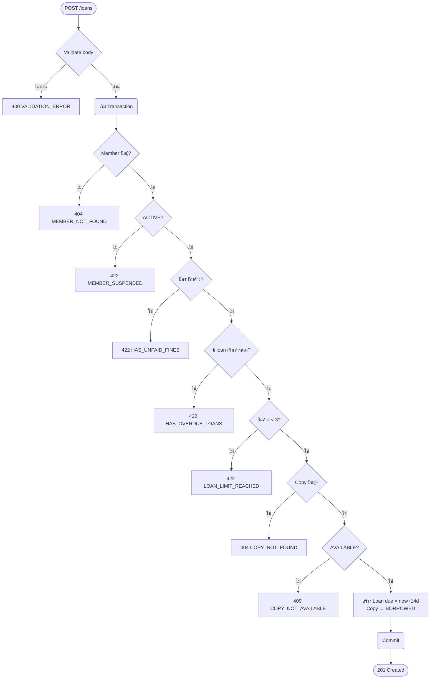
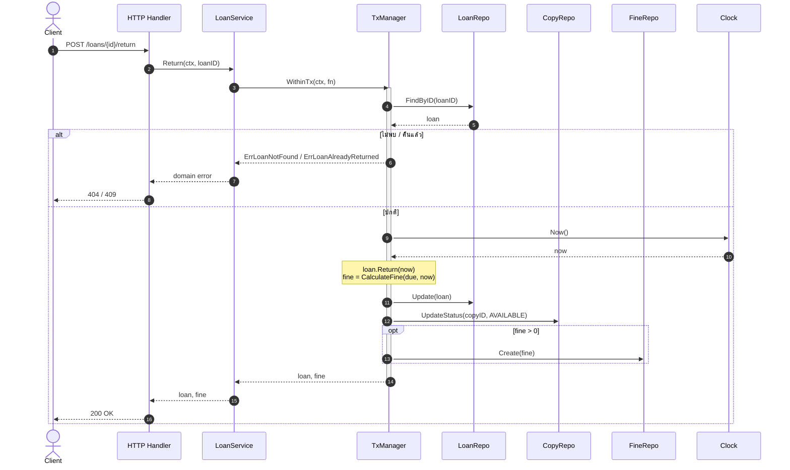
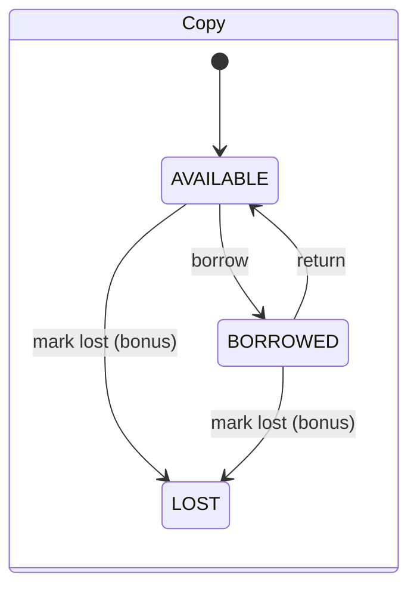
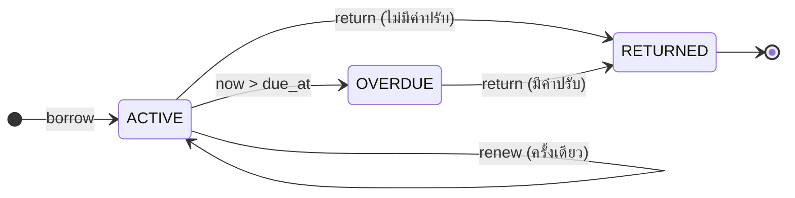

# โจทย์: Library Loan API — ระบบยืม-คืนหนังสือห้องสมุด

> **ระดับ:** กลาง · **ภาษา:** Go · **สถาปัตยกรรม:** Hexagonal (Ports & Adapters) · **ต้องมี Test**
> **เวลาที่แนะนำ:** 2–4 วัน

## 1. ภาพรวม

ให้สร้าง REST API สำหรับห้องสมุดเล็ก ๆ ที่ทำสิ่งเหล่านี้ได้

- จัดการ **สมาชิก** (สมัคร, ดูข้อมูล, ระงับ/เปิดใช้)
- จัดการ **หนังสือ** และ **เล่มจริง (copy)** ของแต่ละเรื่อง (หนังสือ 1 เรื่องมีได้หลายเล่ม)
- **ยืม / ต่ออายุ / คืน** หนังสือ ตามกฎทางธุรกิจ
- คำนวณ **ค่าปรับ** เมื่อคืนช้า และให้ **ชำระค่าปรับ** ได้

สิ่งที่โจทย์นี้ต้องการฝึกไม่ได้อยู่ที่ CRUD แต่อยู่ที่สามเรื่องนี้

1. แยก business logic ออกจาก HTTP และ database ให้ขาดจริง ๆ
2. จัดการ "เวลา" ให้เทสต์ได้ โดยห้ามเรียก `time.Now()` ใน core
3. ทำ transaction/concurrency ให้หนังสือเล่มเดียวกันถูกยืมซ้อนกันไม่ได้

---

## 2. ER Diagram



**หมายเหตุเรื่องข้อมูล**

- เงินเก็บเป็น **integer** (`int64`) ห้ามใช้ float
- สถานะของ loan (`ACTIVE` / `OVERDUE` / `RETURNED`) **ไม่ต้องเก็บใน DB** ให้คำนวณจาก `returned_at`, `due_at` และเวลาปัจจุบัน
- (ถ้าใช้ Postgres) ควรมี partial unique index `UNIQUE (copy_id) WHERE returned_at IS NULL` เป็นด่านสุดท้ายกันการยืมซ้อน

---

## 3. กฎทางธุรกิจ (Business Rules)

### 3.1 การยืม (Borrow)

ตรวจตาม **ลำดับนี้** และคืน error ของข้อแรกที่ไม่ผ่าน (ลำดับต้องแน่นอน เพื่อให้เทสต์ได้)

| # | เงื่อนไข | Error ถ้าไม่ผ่าน |
|---|---|---|
| 1 | มีสมาชิกคนนี้อยู่ | `MEMBER_NOT_FOUND` |
| 2 | สมาชิกมีสถานะ `ACTIVE` | `MEMBER_SUSPENDED` |
| 3 | สมาชิกไม่มีค่าปรับค้างชำระ | `HAS_UNPAID_FINES` |
| 4 | สมาชิกไม่มี loan ที่เกินกำหนดแล้วยังไม่คืน | `HAS_OVERDUE_LOANS` |
| 5 | สมาชิกยืมค้างอยู่ **น้อยกว่า 3 เล่ม** | `LOAN_LIMIT_REACHED` |
| 6 | มีเล่ม (copy) ตาม barcode ที่ส่งมา | `COPY_NOT_FOUND` |
| 7 | เล่มนั้นมีสถานะ `AVAILABLE` | `COPY_NOT_AVAILABLE` |

ถ้าผ่านครบทุกข้อ
- สร้าง loan โดย `borrowed_at = now` และ `due_at = now + 14 วัน`
- เปลี่ยนสถานะ copy เป็น `BORROWED`
- สองขั้นตอนนี้ต้องอยู่ใน **transaction เดียวกัน**

### 3.2 การต่ออายุ (Renew)

| # | เงื่อนไข | Error |
|---|---|---|
| 1 | มี loan นี้อยู่ | `LOAN_NOT_FOUND` |
| 2 | ยังไม่ได้คืน | `LOAN_ALREADY_RETURNED` |
| 3 | ยังไม่เกินกำหนด (`now <= due_at`) | `LOAN_OVERDUE` |
| 4 | ยังไม่เคยต่ออายุ (`renew_count == 0`) | `RENEW_LIMIT_REACHED` |

ถ้าผ่าน ให้ตั้ง `due_at = due_at + 7 วัน` (นับจาก due เดิม ไม่ใช่จาก now) และ `renew_count = 1`

### 3.3 การคืน (Return)

| # | เงื่อนไข | Error |
|---|---|---|
| 1 | มี loan นี้อยู่ | `LOAN_NOT_FOUND` |
| 2 | ยังไม่ได้คืน | `LOAN_ALREADY_RETURNED` |

ถ้าผ่าน
- ตั้ง `returned_at = now` และเปลี่ยน copy กลับเป็น `AVAILABLE`
- คำนวณค่าปรับ ถ้าค่าปรับ > 0 ให้สร้าง record ใน `FINES`
- ทุกขั้นตอนอยู่ใน transaction เดียวกัน

### 3.4 สูตรค่าปรับ

```
lateDuration = returned_at - due_at
ถ้า lateDuration <= 0          → ค่าปรับ 0
lateDays     = ceil(lateDuration / 24h)   // เศษของวันนับเป็น 1 วัน
fine         = min(lateDays × 10, 500)    // วันละ 10 บาท สูงสุด 500 บาท
```

| due_at | returned_at | ค่าปรับ |
|---|---|---|
| 2026-10-14 10:00 | 2026-10-14 10:00 | 0 |
| 2026-10-14 10:00 | 2026-10-14 10:01 | 10 |
| 2026-10-14 10:00 | 2026-10-15 10:00 | 10 |
| 2026-10-14 10:00 | 2026-10-16 09:00 | 20 |
| 2026-10-14 10:00 | 2026-12-13 10:00 | 500 (60 วัน → โดน cap) |

### 3.5 การชำระค่าปรับ

- จ่ายได้เต็มจำนวนเท่านั้น (ไม่ต้องรับ amount) โดยตั้ง `paid_at = now`
- ถ้าจ่ายไปแล้วจะได้ `FINE_ALREADY_PAID`

---

## 4. API Endpoints

| Method | Path | คำอธิบาย |
|---|---|---|
| `POST` | `/members` | สมัครสมาชิก `{name, email}` |
| `GET` | `/members/{id}` | ดูข้อมูลสมาชิก |
| `PATCH` | `/members/{id}/status` | เปลี่ยนสถานะ `{status: "ACTIVE" \| "SUSPENDED"}` |
| `POST` | `/books` | เพิ่มหนังสือ `{isbn, title, author}` |
| `POST` | `/books/{id}/copies` | เพิ่มเล่มจริง `{barcode}` |
| `GET` | `/books?q=&page=1&limit=20` | ค้นหาจาก title/author พร้อม `available_copies` |
| `POST` | `/loans` | ยืม `{member_id, barcode}` |
| `POST` | `/loans/{id}/renew` | ต่ออายุ |
| `POST` | `/loans/{id}/return` | คืน (response แนบ fine ถ้ามี) |
| `GET` | `/members/{id}/loans?status=active\|overdue\|returned` | ประวัติการยืม |
| `GET` | `/members/{id}/fines?unpaid=true` | รายการค่าปรับ |
| `POST` | `/fines/{id}/pay` | ชำระค่าปรับ |

### Validation
- `name` ต้องไม่ว่าง และยาวไม่เกิน 100 ตัวอักษร
- `email` ต้องเป็นรูปแบบ email ที่ถูกต้อง และต้องไม่ซ้ำ
- `isbn` ต้องเป็นตัวเลข 13 หลัก และต้องไม่ซ้ำ
- `barcode` ต้องไม่ว่าง และต้องไม่ซ้ำ
- `page >= 1` และ `1 <= limit <= 100` (ค่า default คือ 1 และ 20)

### ตัวอย่าง: ยืมหนังสือ

```http
POST /loans
Content-Type: application/json

{ "member_id": "7b1c...", "barcode": "LIB-0001" }
```

```http
201 Created

{
  "id": "a93f...",
  "member_id": "7b1c...",
  "copy_id": "c02d...",
  "borrowed_at": "2026-10-01T10:00:00Z",
  "due_at": "2026-10-15T10:00:00Z",
  "returned_at": null,
  "renew_count": 0,
  "status": "ACTIVE"
}
```

### ตัวอย่าง: คืนช้า

```http
POST /loans/a93f.../return

200 OK
{
  "loan": { "...": "...", "status": "RETURNED", "returned_at": "2026-10-17T12:00:00Z" },
  "fine": { "id": "f11e...", "amount": 30, "paid_at": null }
}
```

### รูปแบบ Error (ใช้รูปแบบเดียวกันทุก endpoint)

```json
{ "error": { "code": "LOAN_LIMIT_REACHED", "message": "member already has 3 active loans" } }
```

| HTTP | Error codes |
|---|---|
| 400 | `VALIDATION_ERROR` |
| 404 | `MEMBER_NOT_FOUND`, `BOOK_NOT_FOUND`, `COPY_NOT_FOUND`, `LOAN_NOT_FOUND`, `FINE_NOT_FOUND` |
| 409 | `EMAIL_ALREADY_EXISTS`, `ISBN_ALREADY_EXISTS`, `BARCODE_ALREADY_EXISTS`, `COPY_NOT_AVAILABLE`, `LOAN_ALREADY_RETURNED`, `FINE_ALREADY_PAID` |
| 422 | `MEMBER_SUSPENDED`, `HAS_UNPAID_FINES`, `HAS_OVERDUE_LOANS`, `LOAN_LIMIT_REACHED`, `LOAN_OVERDUE`, `RENEW_LIMIT_REACHED` |
| 500 | `INTERNAL_ERROR` (ห้ามส่งรายละเอียด error ภายในออกไปให้ client) |

---

## 5. Workflow

### 5.1 สถาปัตยกรรม Hexagonal



### 5.2 Flow การยืม



### 5.3 Sequence การคืน (ผ่านแต่ละ layer)



### 5.4 State ของ Copy และ Loan





---

## 6. ข้อกำหนดด้านสถาปัตยกรรม (ต้องทำ)

โครงสร้างที่แนะนำ (ปรับได้ แต่ต้องแยก layer ให้ชัด)

```
.
├── cmd/api/main.go                 # wiring: สร้าง adapter แล้ว inject เข้า service
├── internal/
│   ├── core/
│   │   ├── domain/                 # entity, value object, domain error, CalculateFine
│   │   ├── port/                   # interface ขาเข้า (services) และขาออก (repos, clock, tx)
│   │   └── service/                # implement use case
│   └── adapter/
│       ├── http/                   # handler, DTO, map error → HTTP status
│       ├── repository/memory/      # in-memory implementation (บังคับ)
│       ├── repository/postgres/    # (bonus)
│       └── clock/                  # SystemClock
└── migrations/                     # (bonus)
```

**กฎที่ห้ามละเมิด**

1. package ใน `internal/core/...` **ห้าม import** `net/http`, `database/sql`, driver ของ DB, หรือ package ใน `internal/adapter/...`
2. ห้ามเรียก `time.Now()` ใน core ให้ใช้ `port.Clock` แทน
3. ห้ามสร้าง UUID ตรง ๆ ใน core ให้ใช้ `port.IDGenerator` แทน
4. Service ต้องรับ dependency ผ่าน constructor ในรูป interface เช่น `NewLoanService(repo port.LoanRepository, ...)`
5. Handler ห้ามมี business logic ทำได้แค่ parse, validate รูปแบบ, เรียก service และ map ผลลัพธ์
6. Domain error ต้องเป็นค่าที่เช็คด้วย `errors.Is` ได้ แล้ว handler ค่อยแปลงเป็น HTTP status ในที่เดียว
7. การยืมและการคืนต้องทำผ่าน `TxManager.WithinTx(ctx, func(ctx) error)` (ตัว in-memory implement ด้วย mutex ได้)

ตัวอย่าง outbound port (แค่เป็นแนวทาง)

```go
type Clock interface { Now() time.Time }

type TxManager interface {
    WithinTx(ctx context.Context, fn func(ctx context.Context) error) error
}

type LoanRepository interface {
    Create(ctx context.Context, l *domain.Loan) error
    FindByID(ctx context.Context, id string) (*domain.Loan, error)
    Update(ctx context.Context, l *domain.Loan) error
    ListActiveByMember(ctx context.Context, memberID string) ([]domain.Loan, error)
    // ...
}
```

---

## 7. ข้อกำหนดด้านเทสต์ (ต้องทำ)

| ชั้น | ต้องมี | เครื่องมือ |
|---|---|---|
| **Domain** | table-driven test ของ `CalculateFine` ครอบคลุมทุกแถวในข้อ 3.4 และ edge case ต่าง ๆ ด้วย | `testing` |
| **Service** | เทสต์ทุก error path ของ Borrow/Renew/Return/Pay โดยใช้ fake/mock ของ port และใช้ `FakeClock` ที่กำหนดเวลาได้ | hand-written fake หรือ `gomock`/`mockery` |
| **HTTP adapter** | เทสต์ว่าแต่ละ domain error map ไปเป็น status + code ที่ถูก และ validation ทำงาน | `net/http/httptest` |
| **Repository** | เทสต์ in-memory repo (และ postgres repo ถ้าทำ bonus) | `testing` / testcontainers |
| **Concurrency** | ยิง Borrow copy เดียวกันพร้อมกัน 20 goroutine ต้อง**สำเร็จ 1 ครั้งเท่านั้น** ที่เหลือต้องได้ `COPY_NOT_AVAILABLE` | `go test -race` |

**เกณฑ์ผ่าน**
- `go test ./... -race` ผ่านทั้งหมด
- coverage ของ `internal/core/...` ไม่ต่ำกว่า **80%** (`go test ./internal/core/... -cover`)
- `go vet ./...` ต้องไม่มี warning

### Acceptance Test Cases ขั้นต่ำ

ในตารางนี้ `T0` คือเวลาที่ยืม และทุกเคสใช้ `FakeClock`

| # | Given | When | Then |
|---|---|---|---|
| 1 | สมาชิก ACTIVE, copy AVAILABLE | Borrow | 201, `due_at = T0+14d`, copy เป็น BORROWED |
| 2 | สมาชิก SUSPENDED | Borrow | 422 `MEMBER_SUSPENDED` |
| 3 | สมาชิกยืมอยู่แล้ว 3 เล่ม | Borrow เล่มที่ 4 | 422 `LOAN_LIMIT_REACHED` |
| 4 | สมาชิกมี fine ค้าง **และ** ยืมอยู่ 3 เล่ม | Borrow | 422 `HAS_UNPAID_FINES` (ต้องเป็นไปตามลำดับการตรวจ) |
| 5 | มี loan ค้างอยู่ และตอนนี้ `T0+15d` | Borrow เล่มอื่น | 422 `HAS_OVERDUE_LOANS` |
| 6 | copy ถูกยืมไปแล้ว | Borrow | 409 `COPY_NOT_AVAILABLE` |
| 7 | barcode ไม่มีในระบบ | Borrow | 404 `COPY_NOT_FOUND` |
| 8 | loan ปกติ ตอนนี้ `T0+10d` | Renew | 200, `due_at = T0+21d` |
| 9 | loan ต่ออายุไปแล้ว 1 ครั้ง | Renew | 422 `RENEW_LIMIT_REACHED` |
| 10 | ตอนนี้ `T0+14d+1s` | Renew | 422 `LOAN_OVERDUE` |
| 11 | ตอนนี้ `T0+14d` | Return | 200, ไม่มี fine, copy กลับเป็น AVAILABLE |
| 12 | ตอนนี้ `T0+16d+1h` | Return | 200, fine = 30 |
| 13 | loan คืนไปแล้ว | Return | 409 `LOAN_ALREADY_RETURNED` |
| 14 | fine ยังไม่จ่าย | Pay | 200 และ `paid_at` ถูกตั้งค่า จากนั้นสมาชิกยืมได้อีก |
| 15 | fine จ่ายแล้ว | Pay | 409 `FINE_ALREADY_PAID` |
| 16 | email ซ้ำ | POST /members | 409 `EMAIL_ALREADY_EXISTS` |
| 17 | isbn = `"12345"` | POST /books | 400 `VALIDATION_ERROR` |
| 18 | 20 goroutine พร้อมกัน | Borrow copy เดียวกัน | สำเร็จ 1 ครั้ง, `COPY_NOT_AVAILABLE` 19 ครั้ง |
| 19 | ยืมค้าง 1 เล่ม, ตอนนี้ `T0+20d` | GET loans?status=overdue | ได้ loan นั้นกลับมา และ `status = OVERDUE` |

---

## 8. Bonus (ไม่บังคับ)

- [ ] Postgres adapter + migrations แล้วสลับ adapter ได้ด้วย env (`STORAGE=memory|postgres`) โดยไม่แก้ core
- [ ] Integration test ที่ใช้ `testcontainers-go`
- [ ] `docker-compose.yml` สำหรับรัน API + DB
- [ ] Endpoint `POST /copies/{id}/lost` ที่คิดค่าปรับเท่าราคาหนังสือ (ต้องเพิ่ม field `price` ใน BOOKS)
- [ ] ตรวจ checksum ของ ISBN-13
- [ ] Graceful shutdown และ structured logging (`log/slog`)
- [ ] Architecture test ที่ fail ถ้า `internal/core` ไป import `internal/adapter` (ใช้ `go list -deps` หรือ `go-arch-lint`)

---

## 9. เกณฑ์ให้คะแนน (100 คะแนน)

| หมวด | คะแนน |
|---|---|
| แยก layer ถูกต้องตาม hexagonal (กฎข้อ 6 ครบ) | 25 |
| Business rules ถูกต้องครบ (ข้อ 3) | 25 |
| คุณภาพเทสต์ (ครอบคลุมเคส, ใช้ fake clock, table-driven, อ่านง่าย) | 25 |
| Transaction และ concurrency ถูกต้อง (เคส #18 ผ่านเมื่อรันด้วย `-race`) | 10 |
| Error handling และ HTTP mapping สม่ำเสมอ | 10 |
| Code quality: ชื่อตัวแปร/ฟังก์ชัน, โครงสร้าง, README วิธีรัน | 5 |

---

## 10. ลำดับการทำที่แนะนำ

1. `go mod init` แล้วสร้างโครงโฟลเดอร์ตามข้อ 6
2. เขียน **domain** + `CalculateFine` + เทสต์ (TDD ได้เลย เพราะเป็น pure function)
3. นิยาม **ports** (interfaces)
4. เขียน **service** + fake repo + `FakeClock` + เทสต์ทุก error path
5. เขียน **in-memory adapter** + `TxManager` (mutex) + concurrency test
6. เขียน **HTTP adapter** + error mapping + `httptest`
7. wiring ใน `cmd/api/main.go` แล้วลองยิงด้วย curl/Postman
8. ถ้ามีเวลา ค่อยทำ bonus
